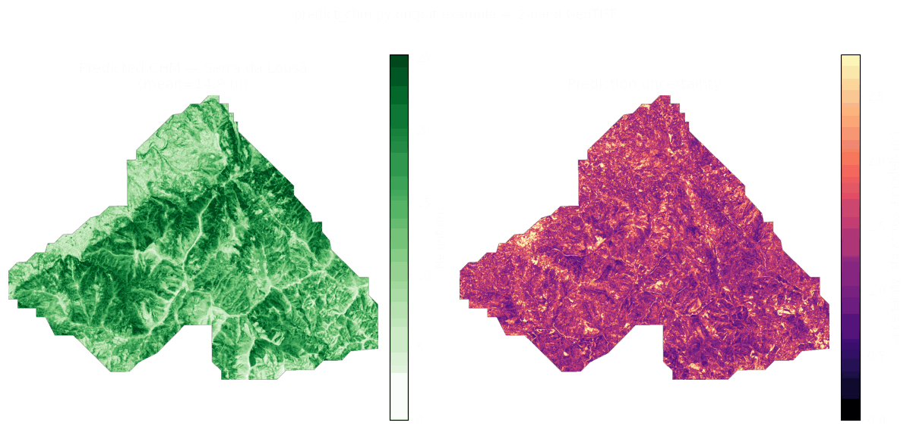

# Canopy Height Model (CHM) — Stacking Ensemble (GEDI + PlanetScope)

A trained machine-learning model that predicts **forest canopy height** (in
meters), pixel-by-pixel, from PlanetScope multispectral imagery, GLCM texture
and terrain derivatives — together with a per-pixel **uncertainty** estimate.
The model was trained on [GEDI](https://gedi.umd.edu/) spaceborne LiDAR relative-height
metrics (`rh98`, optimized) as reference height, over two forest areas in
Portugal (Monsanto and Serra da Lousã).

This repository provides the trained model weights and a standalone inference
script — everything needed to apply the model to your own co-registered
raster stack. It does not include the training pipeline or the original
datasets (see [Scope](#scope) below).



*Example output of `predict_chm.py` over the Serra da Lousã study area:
predicted canopy height (left) and per-pixel uncertainty (right), downsampled
for preview.*

## How it works

The model is a **stacking ensemble** of 9 base regressors, combined by a
linear Ridge meta-learner:

| Base models | Meta-learner |
| --- | --- |
| Random Forest, XGBoost, LightGBM, Extra Trees, SVR, Ridge, Lasso, ElasticNet, KNN | Ridge regression |

1. Each of the 9 base models predicts canopy height independently from 99
   input features (see [docs/FEATURES.md](docs/FEATURES.md)).
2. The Ridge meta-learner combines the 9 base predictions into a single final
   estimate (`CHM_predicted_m`).
3. The standard deviation across the 9 base predictions is reported as a
   per-pixel uncertainty estimate (`CHM_uncertainty_m`) — how much the base
   models disagree on that pixel, not a formal statistical confidence
   interval.

Full methodology, feature engineering and model-selection details are
described in the accompanying thesis (see [Citation](#citation)).

## Performance

Out-of-fold (5-fold CV) evaluation on the training data:

| Model | rRMSE | Pearson r |
| --- | --- | --- |
| Best single base model (XGBoost) | 32.93% | 0.673 |
| Simple mean of 9 models | 32.86% | 0.677 |
| Weighted mean (∝ 1/rRMSE) | 32.85% | 0.677 |
| **Stacking (Ridge meta-learner)** | **32.69%** | **0.679** |

rRMSE = RMSE normalized by the mean of the reference height. See the thesis
for the full breakdown per base model, per area, and validation against
independent LiDAR.

## Requirements

- Python 3.10+
- See [requirements.txt](requirements.txt) (rasterio, numpy, pandas, joblib,
  scikit-learn, xgboost, lightgbm — pinned to the versions used to train and
  pickle the models)

```bash
python -m venv .venv && source .venv/bin/activate
pip install -r requirements.txt
```

## Usage

Your input rasters must:

- share the exact same grid (shape, transform, CRS);
- carry the 99 required features as **named bands** (band description),
  spread across one or more files — see [docs/FEATURES.md](docs/FEATURES.md)
  for the full list and how to set band descriptions.

```bash
python predict_chm.py \
    --inputs composite_8b.tif indices_8b.tif glcm.tif terrain.tif \
    --models-dir models/ \
    --output CHM_predicted.tif
```

Output: a 2-band GeoTIFF —

- **Band 1** `CHM_predicted_m` — predicted canopy height (m)
- **Band 2** `CHM_uncertainty_m` — std. deviation across the 9 base models (m)

Nodata pixels (`-9999`) mark locations where any of the 99 input features was
missing/NaN. Predictions are capped at 70 m by default (`--max-height-m`) —
see [Limitations](#limitations).

Run `python predict_chm.py --help` for all options (row chunk size for
memory/speed trade-off, custom height cap, etc.).

## Scope

This repository is **inference-only**: it ships the final trained ensemble
and the script to apply it to new data. It does not include:

- the training pipeline (feature engineering, hyperparameter search, model
  selection, cross-validation);
- the PlanetScope imagery, GEDI footprints, or DGT terrain data used for
  training;
- the SHAP validation / independent LiDAR validation notebooks.

These live in the private research repository used for the thesis; get in
touch (see [Citation](#citation)) if you need the full pipeline for research
purposes.

## Limitations

- **Training domain**: the models only saw **forest pixels within GEDI
  footprints**, in two Portuguese study areas (Monsanto peri-urban forest,
  Serra da Lousã mountain range). Predictions on land cover outside that
  distribution (buildings, roads, agricultural land, other biomes/climates)
  are extrapolations and can be unreliable — heights were observed to spike
  above 100 m on non-forest pixels during development, which is why the
  output is capped at 70 m by default (the max plausible height in the
  reference LiDAR).
- **Sensor/DEM dependency**: trained on PlanetScope 8-band Surface
  Reflectance composites and terrain derivatives from a DGT LiDAR DTM.
  Substituting other sensors or a coarser DEM (SRTM, Copernicus GLO-30,
  TanDEM-X) as input is expected to degrade accuracy relative to the reported
  performance, even if band names match.
- **Uncertainty band is not a confidence interval**: it reflects disagreement
  between the 9 base models, not formally calibrated prediction uncertainty.
- **Units**: base/meta models were trained on the reference height in
  centimeters; `predict_chm.py` converts to meters internally — no action
  needed from the caller.

## Repository contents

```text
public_repo/
├── predict_chm.py       # inference CLI
├── models/               # trained weights (Git LFS)
│   ├── RF_base.joblib, XGB_base.joblib, LGB_base.joblib, ET_base.joblib,
│   │   SVR_base.joblib, Ridge_base.joblib, Lasso_base.joblib,
│   │   ElasticNet_base.joblib, KNN_base.joblib
│   ├── meta_ridge.joblib
│   └── ensemble_meta.json   # OOF metrics, meta-learner coefficients, config
├── docs/
│   └── FEATURES.md       # the 99 required input features
├── requirements.txt
├── LICENSE                # MIT (code)
├── LICENSE-MODEL.md       # CC-BY-4.0 (model weights)
└── CITATION.cff
```

`models/*.joblib` are tracked with [Git LFS](https://git-lfs.com/) (two of
the base models are ~110–125 MB each) — run `git lfs install` before
cloning. <!-- TODO: once published, optionally also add a GitHub Releases
page with the model files as plain download links for users who'd rather
not pull LFS objects. -->

## Citation

If you use this model or code, please cite the thesis it was produced for —
see [CITATION.cff](CITATION.cff).

## About the thesis

This model was produced as part of the MSc dissertation *"Canopy Height
Assessment: A Machine Learning Approach using PlanetScope High-Resolution
Images"* by **Afonso Gonçalves Nóbrega**, Department of Electrical and
Computer Engineering, NOVA University Lisbon — Master in Electrical and
Computer Engineering, Specialization in Digital Systems and Electronics.

- **Supervisor**: André Teixeira Bento Damas Mora, Assistant Professor, NOVA
  University Lisbon
- **Co-supervisor**: João Pereira-Pires, Researcher, Uninova

The dissertation is a work in progress; details in [CITATION.cff](CITATION.cff)
will be updated once it is submitted and defended.

## License

- Code: [MIT](LICENSE)
- Model weights: [CC-BY-4.0](LICENSE-MODEL.md)
